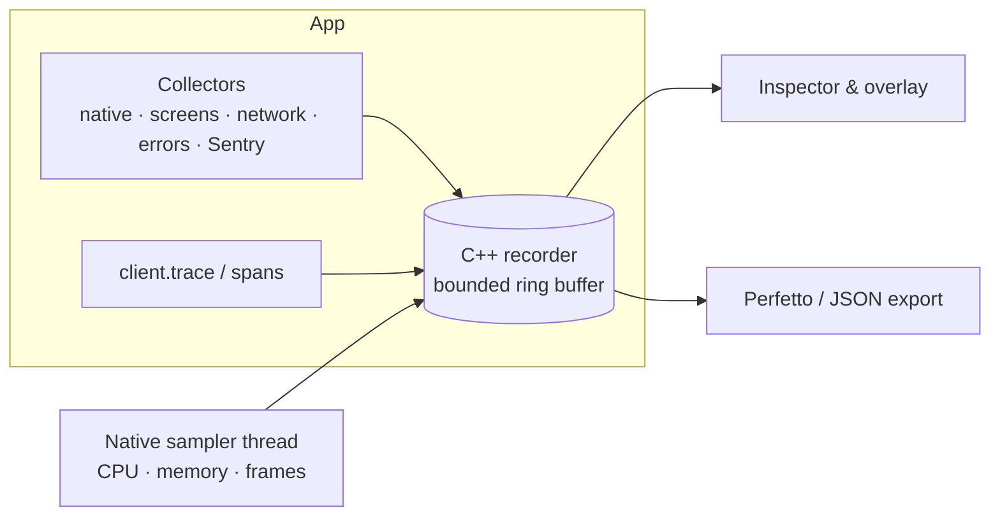

# react-native-nitro-tracing

In-app performance tracing for React Native, for development, custom and UAT builds. It records spans, marks and metrics into a bounded C++ recorder. Native collectors measure frames, CPU and memory, and a live inspector runs inside the app. Recordings export to [Perfetto](https://ui.perfetto.dev).

Tracing that only works in a debug build misses the builds testers actually use. This library ships in any build the app chooses to include it in. A tester can flag the moment something felt slow, capture a CPU profile of that moment, and share a trace for the developer to open in Perfetto.

- **Native recorder.** C++ owns timing, identity, retention and serialization through [Nitro Modules](https://nitro.margelo.com). The buffer is bounded, and metric samples can never evict spans.
- **Collectors you choose.** Native frame, CPU and memory sampling; screens; network; JS errors; runtime metrics; the Performance API; and Sentry as an optional alternative measurement layer.
- **Inspector.** The Summary tab triages issues by topic. Timeline groups events by screen visit, Explore searches every trace, and Metrics charts every series. It uses native tabs and menus on iOS (Liquid Glass on iOS 26).
- **Live overlay.** A draggable FPS bubble with a non-modal sheet that follows the current screen, plus **Flag** and **Share trace** buttons.
- **Export.** Perfetto / Chrome Trace Event JSON with a lane per source, the lossless recording JSON, and Hermes CPU profiles.

## 🚀 How to use

Requires a development build or your own native build. Expo Go cannot load Nitro modules.

1. **Install** the library and its Nitro runtime:

   ```sh
   npx expo install react-native-nitro-tracing react-native-nitro-modules
   ```

2. **Create one client** in your app's setup layer, with the collectors you want:

   ```ts
   import { createTraceClient } from 'react-native-nitro-tracing/client'
   import { createExpoTraceSharing } from 'react-native-nitro-tracing/expo'
   import {
     createErrorsPlugin,
     createNativeMetricsPlugin,
     createNavigationPlugin,
     createNetworkPlugin,
   } from 'react-native-nitro-tracing/plugins'

   export const tracing = createTraceClient({
     ...createExpoTraceSharing(),
     runtimeMetrics: true,
     plugins: [
       createNativeMetricsPlugin(),
       createNavigationPlugin(navigationRef),
       createNetworkPlugin(),
       createErrorsPlugin(),
     ],
   })
   await tracing.start()
   ```

3. **Mount the UI** once, last at the app root. Include it only in the builds that should have it:

   ```tsx
   import {
     TraceInspector,
     TraceOverlay,
   } from 'react-native-nitro-tracing/react'

   {
     showTracing && (
       <>
         <TraceOverlay client={tracing} />
         <TraceInspector client={tracing} />
       </>
     )
   }
   ```

4. **Reproduce, flag, share.** Tap the bubble to watch the current screen live. Tap **Flag** when something feels slow, then **Share trace** and open the file at [ui.perfetto.dev](https://ui.perfetto.dev).

[Getting started](docs/getting-started.md) covers optional peers, the Expo dev menu and gating for UAT builds.

## How it works



Every producer writes into one recording per session. The recorder keeps a monotonic clock, explicit parent IDs and a bounded history. Metric samples may use at most half of it, so a multi-hour session keeps its spans. The TypeScript client owns the recording lifecycle and plugins. The React layer only reads it: polling happens while the UI is visible, and only new events cross the bridge. See [architecture](docs/architecture.md).

## Documentation

| Guide                                      | What it covers                                                                    |
| ------------------------------------------ | --------------------------------------------------------------------------------- |
| [Getting started](docs/getting-started.md) | Install, peers, client setup, dev menu, custom and UAT builds                     |
| [Collectors](docs/collectors.md)           | Every plugin, its options and the span, mark and metric names it records          |
| [Inspector and overlay](docs/inspector.md) | Summary, Timeline, Explore, Metrics, the live overlay, budgets, localization      |
| [Exporting traces](docs/exporting.md)      | Perfetto, recording JSON, Flag with CPU profile, custom share adapters            |
| [Native API](docs/native-api.md)           | `Tracing.startRecording`, span handles, paging, limits, the `client.trace` facade |
| [Architecture](docs/architecture.md)       | Recorder, retention, sampler, export lanes, plugin lifecycle                      |
| [Troubleshooting](docs/troubleshooting.md) | Known issues and their fixes                                                      |
| [Releasing](docs/releasing.md)             | release-it, npm trusted publishing, prerelease channels                           |
| [Status](docs/status.md)                   | What is verified on devices and what remains                                      |

## Compatibility

| Requirement   | Version                                                                     |
| ------------- | --------------------------------------------------------------------------- |
| React Native  | New Architecture, Hermes. Verified on 0.85.3 with Expo SDK 56 and React 19. |
| Nitro Modules | `react-native-nitro-modules` ^0.37.1                                        |
| iOS           | Native tabs with Liquid Glass on iOS 26; React Native fallbacks elsewhere   |
| Android       | armeabi-v7a, arm64-v8a, x86, x86_64 (NDK 27)                                |

## Develop

```sh
pnpm install
pnpm check          # build, typecheck, JS, native and Sentry tests, formatting, release script
pnpm pack:check     # verify the tarball a consumer installs
pnpm example ios    # or android
```

See [CONTRIBUTING](CONTRIBUTING.md). Generated Nitro bindings are committed; consumers never run Nitrogen.

## License

MIT
