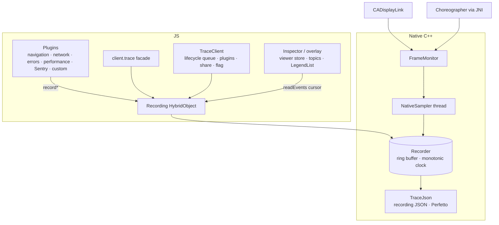

# Architecture

## Layers

**Native core (C++).** `Recording` and `TraceSpan` are Nitro HybridObjects over one `Recorder`. C++ owns timing, span identity, validation, retention, completion and serialization. Snapshots and exports run through Nitro promises, off the JS thread. The root entry point exports this API unchanged.

**Client (TypeScript).** `createTraceClient` owns one recording at a time. It serializes lifecycle transitions (start, stop, export, profile, flag) through a queue, starts and stops plugins, and publishes a snapshot that React subscribes to. Sentry, Hermes and Expo are injected, so importing the core never initializes an SDK.

**React.** The viewer reads the client and never writes to it. While visible, it pages new events with a sequence cursor, so each poll moves only what changed. Live counters live in a small `useSyncExternalStore` store, and only the header subscribes to them. Topics, the timeline and metrics are derived view models. Lists are virtualized, and native tabs freeze hidden screens.

**Platform glue.** A frame source on each platform feeds the shared `FrameMonitor`: CADisplayLink on iOS (registered from a constructor in `NitroTracingFrameSource.mm`), and Choreographer on Android (Kotlin, calling into C++ over JNI). Frame callbacks run only while a sampler holds the monitor.

## Recorder and retention

- One monotonic clock per recording. Timestamps are milliseconds since the recording started, and exports include a wall-clock anchor.
- Events get a global, increasing `sequence`. Readers page with `afterSequence`, and the UI keys rows by sequence.
- Budgets:
  - `maxEvents` and `maxBytes` bound retained history, and `maxActiveSpans` bounds open spans.
  - Oldest events are evicted first. `droppedEvents` counts every evicted or rejected event, and `droppedSpans`, `droppedMarks` and `droppedMetrics` split it by kind.
- **Metric fairness.** Periodic samples may fill at most half of `maxEvents`. When they reach it, a new sample replaces the oldest sample instead of evicting the oldest event. Metric series are rolling windows and never count as dropped, so continuous sampling cannot erase a long session's spans.
- Source span IDs (`sourceSpanId`, `sourceParentSpanId`) let external producers such as Sentry or upload engines keep parent links, even when the parent completes after its children. Missing or evicted parents stay visible as incomplete relationships.

## Native sampler

`NativeSampler` is one thread per recording. Every window (`intervalMs`) it writes:

- process CPU from `getrusage` deltas;
- memory: `phys_footprint` on iOS, `/proc/self/statm` RSS on Android;
- and, when frames are enabled, the `FrameMonitor` window: display callbacks, max gap, slow (>1.5× interval) and frozen (≥700 ms) frames.

The display interval is taken from the platform, or inferred from the minimum observed gap. The sampler stops with the recording and is joined on dispose.

## Export

`TraceJson` serializes a snapshot in two formats:

- **Recording JSON** (`schemaVersion: 1`) — lossless events in sequence order.
- **Chrome Trace Event / Perfetto** — spans become complete (`X`) events on lanes per `source`. Lanes are assigned greedily, so slices on one lane nest strictly (Perfetto rejects partial overlap). Marks become instants, and metrics become counters.

## Plugin lifecycle

A plugin runs `start({ recording, reportError })` and returns `stop()` and optionally `flush()`. On stop, the client:

1. stops producers;
2. freezes the native recording;
3. runs exporters.

Failures are isolated per plugin and reported through `onError`. Capture and export are separate roles: the Sentry plugin maps Sentry's epoch timestamps onto the recording clock, and when exporting it skips spans that it captured.

## Design choices

- **Explicit parents, not a current-span stack.** Concurrent async work cannot corrupt nesting.
- **Bounded, never growing.** Every buffer has a budget, and the UI shows what was dropped.
- **Measurement layers are swappable.** Native and Sentry write the same metric names, and the UI reads names, not providers.
- **The app decides exposure.** No `__DEV__` gating in the package, so custom and UAT builds work the same as dev.
