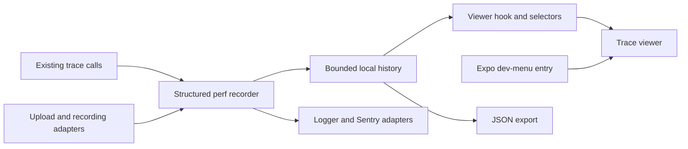

# Tracing and dev-client viewer investigation

Investigated 2026-09-23. Optic reference is pinned to
[`e445c8f77b4c22370ed03a20e84213ce9cf08344`](https://github.com/adnxy/optic-react-native/tree/e445c8f77b4c22370ed03a20e84213ce9cf08344).
This is a source review and proposal; no runtime implementation or device benchmark was performed.

## Recommendation

Extend the host app's perf package with structured recording and an on-device viewer opened
from the Expo development menu. Keep existing instrumentation and Sentry reporting.
Borrow Optic's accessible dashboard concept rather than adopting its collectors.
“Better” here means concurrent upload correctness, useful timelines, bounded
overhead, explicit metric semantics, and integration with our native upload domain.
It does not mean replacing a native CPU/memory profiler.

## What we already have

| Existing piece | Reuse | Gap |
| --- | --- | --- |
| `trace.ts` | Marks, async durations, metrics, correlation by ID, duplicate suppression | No span hierarchy, outcome, active-span record, or session identity |
| `reporter.ts` | One observer and pluggable sink | Structured entry drops start time and metric value; no retained history |
| `services/perf` | Logger and Sentry breadcrumbs, development default, build-time override | Local viewer needs its own destination and runtime controls |
| `uploadSentry.ts` and `liveRecordingSentry.ts` | Domain operations, outcomes, throughput and recording context | Separate instrumentation path; these spans do not automatically enter the local perf sink |
| `LiveDebugOverlay` | Existing queue, segment and buffered-duration concepts | Screen-specific; configured camera FPS is not measured frame performance |

Current call sites cover picking, copying/persisting, compression, item creation,
queue wait, first byte and total upload duration. Sources:
`useMediaUpload`,
`UploadFileBaseService`,
`compression`,
`createUploadingContext`,
and `useUploadStore`.
The existence of a metric API does not mean these paths already emit time-series metrics.

Specific issues to address before presenting the data:

- Preserve `startTime` and metric `value` in structured output; a duration alone
  cannot position a bar in a waterfall. Add units explicitly at instrumentation sites.
- Make recording lifecycle restartable. Currently `stopTracing()` only flips a
  flag; `startTracing()` subsequently returns early. `setTracingEnabled(true)` can
  resume, but there is no observer teardown, sink replacement or session reset.
- Bound correlation state as well as completed history. `trace.clear(id)` is
  explicitly called on completion in the store; cancellation/removal paths shown
  there do not do so. Add terminal cleanup and expiration as a backstop.
- Isolate recorder and sink errors. `measure()` records in `finally`, so a
  recording exception could replace an operation result/error. A throwing sink
  also skips the reporter's remaining entries and buffer cleanup.
- Reconsider unconditional global `clearMarks/Measures/Metrics`: safe only under
  the current single-consumer assumption; it can interfere with other consumers.

These findings follow directly from the linked tracing, reporter and store code;
they have not been reproduced as device failures.

## Comparison with Optic

| Area | Optic at the pinned revision | Proposed approach |
| --- | --- | --- |
| Interaction traces | Active traces keyed by name; concurrent same-name operations overwrite each other; `Date.now()` durations | Preserve correlation IDs; introduce explicit span/parent IDs and monotonic timing |
| Retention | Store retains 10 completed traces and 50 network requests | Configurable history bounded by count, age and payload size; show dropped data |
| Network collection | Global fetch replacement; reconstructs responses, parses JSON twice, records success through `.json()`/`.text()` consumption | Instrument our API and native engine boundaries, preserving responses |
| Screen integration | Exported provider uses automatic screen tracking tied to navigation libraries | Explicit screen/tab context, independent of router choice |
| FPS | JavaScript `requestAnimationFrame` counter | Label JS frame cadence honestly; native UI/camera metrics require separate sources |

Optic sources: [trace manager](https://github.com/adnxy/optic-react-native/blob/e445c8f77b4c22370ed03a20e84213ce9cf08344/src/metrics/trace.ts),
[metrics store](https://github.com/adnxy/optic-react-native/blob/e445c8f77b4c22370ed03a20e84213ce9cf08344/src/store/metricsStore.ts),
[network collector](https://github.com/adnxy/optic-react-native/blob/e445c8f77b4c22370ed03a20e84213ce9cf08344/src/metrics/network.ts),
[exported provider](https://github.com/adnxy/optic-react-native/blob/e445c8f77b4c22370ed03a20e84213ce9cf08344/src/providers/OpticProvider.tsx),
[screen hook](https://github.com/adnxy/optic-react-native/blob/e445c8f77b4c22370ed03a20e84213ce9cf08344/src/hooks/useAutoScreenName.ts),
[FPS collector](https://github.com/adnxy/optic-react-native/blob/e445c8f77b4c22370ed03a20e84213ce9cf08344/src/metrics/fps.ts).

A fetch wrapper would also miss transfers performed by our Nitro native engine.
Optic retains full URLs, which is unsuitable for our presigned upload URLs without
sanitization. Its package declares MIT and its test script is a placeholder
([package manifest](https://github.com/adnxy/optic-react-native/blob/e445c8f77b4c22370ed03a20e84213ce9cf08344/package.json)).
The recommendation is an independent implementation, with no copied source.

## Dev-client entry and experience

Yes, a custom **Open traces & metrics** menu item is supported. Expo SDK 56 exposes
`registerDevMenuItems` through `expo-dev-client`, including `shouldCollapse` to
close the menu on selection. We already depend on that package, and its installed
`src/DevClient.ts` re-exports `expo-dev-menu`.
[Expo SDK 56 API](https://docs.expo.dev/versions/v56.0.0/sdk/dev-client/#devclientregisterdevmenuitemsitems).

Register entries once through a development-tools service: repeated registration
replaces previous custom entries ([Expo menu documentation](https://docs.expo.dev/versions/latest/sdk/dev-menu/#extending-the-dev-menu)).
Use the existing package export rather than adding a direct native dependency.

Suggested viewer:

1. **Overview:** active operations, error count, queue depth, throughput, recording
   backlog; duration summaries with sample count and selected time window.
2. **Traces:** filter by operation, session, status and ID; select an upload to see
   its waterfall, queue delay, preparation, transfer and completion events.
3. **Metrics:** numeric series with units, window selection and gaps displayed;
   distinguish transfer throughput from total-workflow throughput.
4. **Details and controls:** sanitized attributes, outcome, start/duration,
   capture/pause, clear history and export a versioned JSON snapshot.

Use a root modal/overlay so opening the tool keeps the live screen mounted. The
actual `App.tsx` renders `MainScreen` or
`UploadingScreen` directly; the separate navigator is not the current root.
Verify that presenting the modal and dev menu does not interrupt the camera or
recording on either platform. Keep capture independent of viewer visibility.

Avoid an always-rendering full dashboard. Publish bounded snapshots to the UI at
a modest rate (initial proposal: 2–4 Hz while visible); virtualize lists and batch
progress samples. This is a starting policy to benchmark, not a measured budget.

## Architecture and data

- the host app's perf package: framework-independent event schema, timing,
  correlation, retention, subscription and export. Preserve existing public calls.
- `services/perf/`: enablement, app collectors, sanitization and sink wiring.
  Bridge Sentry-specific helpers here incrementally; do not monkeypatch the SDK
  or accidentally create duplicate production transactions.
- `services/devtools/`: menu registration and open/close actions, exposed by barrel.
- `store/`: viewer filters/selection and pure aggregation policies with tests.
- `hooks/useTraceViewer`: subscribe and orchestrate view models.
- `screens/TraceViewer/`: rendering only. User-facing labels use the host app's i18n package.
  `App.tsx` only calls setup and renders the host.

Proposed event fields: schema version, event ID, session ID, correlation ID,
optional span/parent IDs, stable name, kind, monotonic start, optional duration,
outcome, optional metric value/unit, and sanitized attributes. Anchor each session
to wall time for export; never mix monotonic clocks across process restarts.
Use explicit parent handles across queues and callbacks; existing IDs group
operations but do not establish a trustworthy parent-child tree by themselves.

Retain attributes through an allowlist and cap strings/payloads before buffering.
Exclude signed URL queries, authorization, local file paths and recording names
by default. The existing file-upload marks already avoid full filenames.
The verbose `engine tracing`
documents previous JS stalls from large state serialization; capture compact
transitions and sampled counters, not whole engine snapshots.

## Delivery sequence and limits

1. **Recorder foundation:** preserve timestamp/value/unit, isolate failures,
   bounded history, restart/clear semantics and export. Tests: concurrent same-name
   work, failure preservation, retention/expiration, malformed attributes and toggles.
2. **Dev-menu MVP:** modal with trace list, flat correlated waterfall, metrics and
   controls. Existing marks/measures become useful immediately; show missing data
   explicitly. Test menu reopen, Fast Refresh, long sessions and active recording.
3. **Domain integration:** explicit span hierarchy, upload/part/segment relationships,
   retry/outcome events and selected time-series metrics. Adapt existing Sentry
   helpers without losing their reporting behavior.
4. **Optional expansion:** browser viewer through an
   [Expo dev-tools plugin](https://docs.expo.dev/debugging/devtools-plugins/), then
   native instrumentation only for measurements we actually need.

Steps 1–3 can be JS-only using the existing development client, subject to testing
against the installed binary. They should not require a new native dependency.
Keep the viewer development-only; production Sentry reporting remains independently
configured. Release profiling and native sensor additions need a separate scope.

JS cannot observe precise native execution while suspended/killed. Although
`uploadSentry.ts` mentions reconstructing from durable native timestamps, the
current [`UploadRecord`](../packages/react-native-nitro-upload/src/types.ts)
contract exposes no enqueue/start/finish timestamps or attempt history. Accurate
background reconstruction requires extending native storage and the public contract,
then rebuilding. Until then mark the gap as unknown/reconciled, not measured.

Similarly, true UI FPS, CPU, memory and camera dropped-frame metrics are not supplied
by the current perf recorder. Do not infer them from a JS timer or configured FPS.
Benchmark capture disabled, capture with viewer closed, and capture with viewer open
on physical iOS/Android devices during multipart uploads and recording before
claiming low overhead. No such measurements were made during this investigation.
